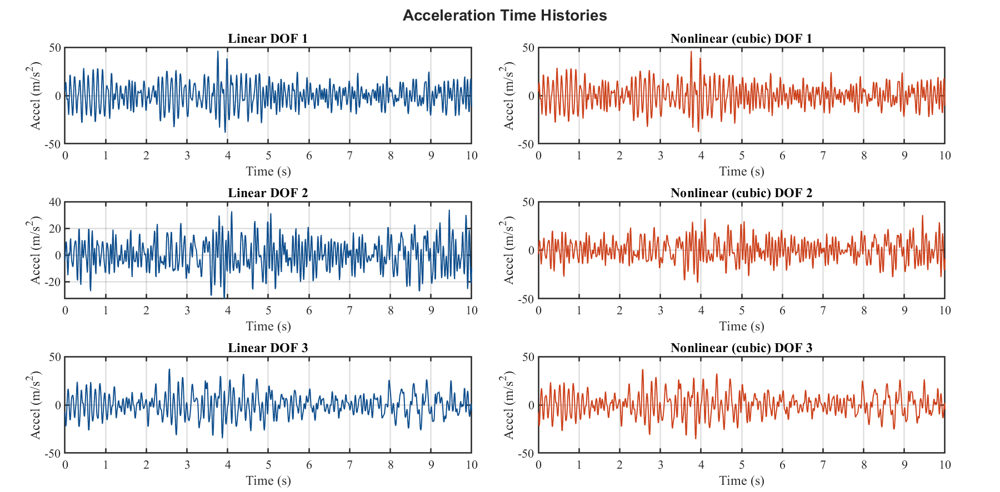
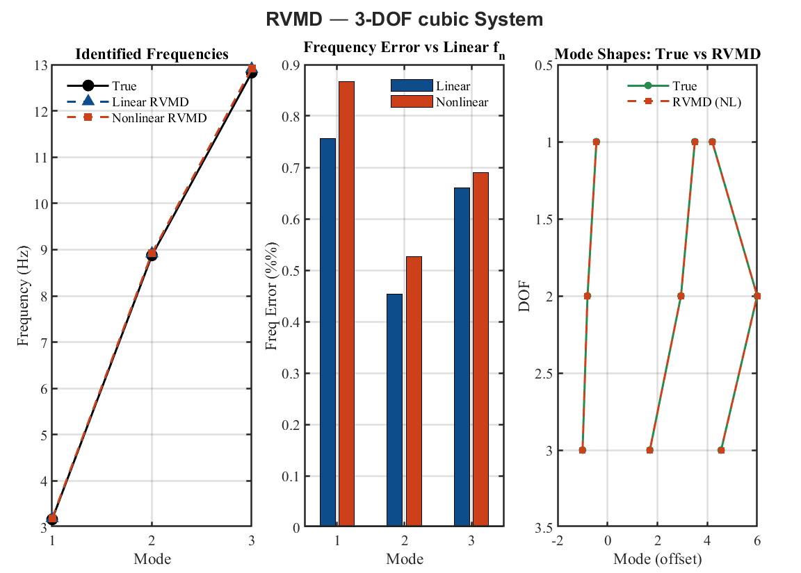
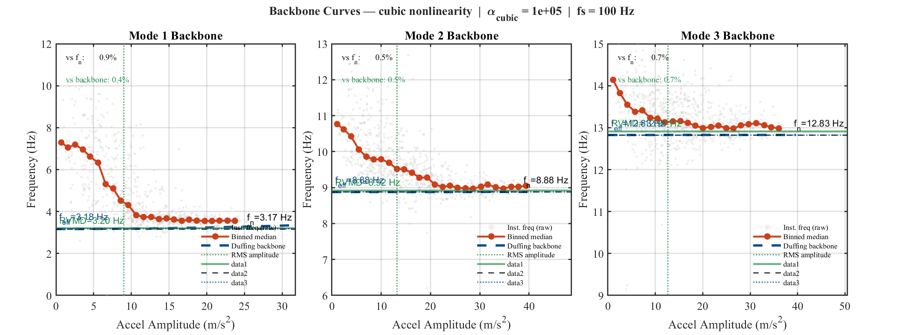

# RVMD-based-non-linear-modal-identification-for-structural-dynamics

## Abstract

This work presents a MATLAB framework for simulating nonlinear multi-degree-of-freedom (MDOF) systems and analyzing their responses using Reduced Order Variational Mode Decomposition (RVMD). The study investigates whether RVMD can extract physically meaningful modal information under nonlinear dynamics and measurement noise. Results demonstrate consistent modal identification, robustness to noise, and sensitivity to nonlinear effects.

---

## 1. Problem Statement

Structural responses under realistic conditions are influenced by:

* nonlinear behavior,
* measurement noise,
* modal coupling.

These effects limit the applicability of classical modal analysis. This work evaluates RVMD as a **data-driven modal decomposition tool** for such scenarios.

---

## 2. Methodology (Concise)

### Structural Model

A 3-DOF system governed by:

M ẍ + C ẋ + K x + fₙₗ(x) = F(t)

Nonlinearity includes:

* cubic stiffness,
* breathing crack,
* combined effects.

---

### Simulation

* Numerical integration (`ode45`)
* Broadband/chirp excitation
* Additive noise (controlled SNR)
* Steady-state extraction

  

  <b>Figure 1:</b> Visualization of the linear and non-linear 3dof system acceleration response.

---

### Analysis Pipeline

1. FFT → baseline frequency content
2. Hilbert transform → instantaneous frequency & amplitude
3. RVMD → modal decomposition
4. Validation → frequency error + MAC
5. Backbone comparison → nonlinear consistency

---

## Results

### RVMD vs True and Backbone Frequencies

| Mode | fₙ (Hz) | RVMD (Linear) | RVMD (Nonlinear) | Backbone | Errₙ (%) | Err_bb (%) |
|------|--------|--------------|------------------|----------|----------|------------|
| 1    | 3.168  | 3.192        | 3.195            | 3.182    | 0.87     | 0.40       |
| 2    | 8.876  | 8.916        | 8.922            | 8.876    | 0.53     | 0.52       |
| 3    | 12.826 | 12.910       | 12.914           | 12.826   | 0.69     | 0.69       |

**Table:1** Comparison of true, RVMD-estimated, and backbone modal frequencies. RVMD estimates show <1% error and closely follow nonlinear backbone predictions

### Modal Identification
RVMD accurately recovers modal frequencies for both linear and nonlinear systems with errors below **1%**.  
Mode shapes show near-perfect agreement with analytical solutions (**MAC ≈ 1.0**), indicating high-fidelity decomposition.

  

  <b>Figure 2:</b> Comparison of the results produce by RVMD with the base truth.

---

### Nonlinear Behavior
Under nonlinear conditions, RVMD maintains stable performance and captures **effective modal dynamics**.  
Estimated frequencies align closely with **nonlinear backbone predictions** (error < 1%), demonstrating sensitivity to amplitude-dependent effects.

  

  <b>Figure 3:</b> Frequency–amplitude backbone curves for the nonlinear system. RVMD-estimated modal frequencies follow the theoretical trend, capturing amplitude-dependent dynamics.

---

### Noise Robustness
RVMD remains stable under noise, with frequency errors typically below **1%** across varying SNR levels.  
Modal estimates are smoother and less sensitive compared to raw signals.

---

### Summary
- Accurate modal frequencies (**<1% error**)  
- Near-perfect mode shape recovery (**MAC ≈ 1.0**)  
- Stable under nonlinear dynamics and noise  
- Strong agreement with nonlinear backbone behavior

- 

## 5. Conclusion

This study demonstrates that RVMD is a promising tool for modal analysis in nonlinear structural systems. While not achieving perfect modal disentanglement, it provides consistent and physically meaningful representations under challenging conditions.

---

## 6. Current Status

Ongoing work includes:

* improved damage indicators
* environmental effect modeling
* validation on experimental datasets

---
